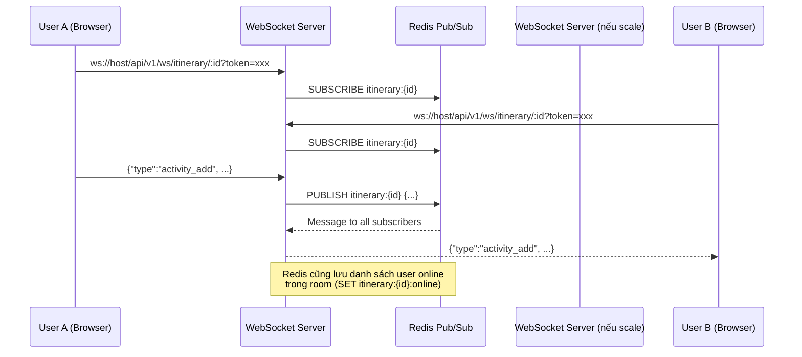

# Realtime Collaboration cho Itinerary Edit

Cho phép nhiều người cùng chỉnh sửa một itinerary. Khi user A thêm/sửa/xóa activity, user B đang mở cùng itinerary sẽ nhận được thay đổi ngay lập tức qua WebSocket.

## Kiến trúc tổng quan



## Proposed Changes

### Redis Client

#### [NEW] [redis.go](file:///home/thahvinh/Desktop/Project_S/tripcompass/backend/internal/database/redis.go)
- Kết nối Redis qua `github.com/redis/go-redis/v9` (đã có trong go.mod).
- Export hàm `ConnectRedis(cfg)` trả về `*redis.Client`.

---

### WebSocket Hub (quản lý rooms & connections)

#### [NEW] [hub.go](file:///home/thahvinh/Desktop/Project_S/tripcompass/backend/internal/ws/hub.go)
- **`Hub`** struct: quản lý tất cả rooms (`map[string]*Room`).
- **`Room`** struct: quản lý connections trong 1 itinerary (`map[*Client]bool`).
- **`Client`** struct: wrap `websocket.Conn` + `userID` + `roomID`.
- Methods: `Join`, `Leave`, `Broadcast` (gửi message tới tất cả client trong room, trừ sender).

#### [NEW] [client.go](file:///home/thahvinh/Desktop/Project_S/tripcompass/backend/internal/ws/client.go)
- Read pump: đọc message từ WebSocket client → xử lý + broadcast.
- Write pump: đọc từ channel `send` → ghi ra WebSocket.
- Ping/pong heartbeat.

#### [NEW] [redis_pubsub.go](file:///home/thahvinh/Desktop/Project_S/tripcompass/backend/internal/ws/redis_pubsub.go)
- **Publish**: Khi nhận message từ client → `PUBLISH itinerary:{id}` vào Redis.
- **Subscribe**: Khi client join room → `SUBSCRIBE itinerary:{id}`, nhận message từ Redis → broadcast trong room.
- **Online tracking**: `SADD itinerary:{id}:online {userID}`, `SREM` khi disconnect, `SMEMBERS` để list users.

---

### WebSocket Handler

#### [NEW] [ws.go](file:///home/thahvinh/Desktop/Project_S/tripcompass/backend/internal/handlers/ws.go)
- `HandleWebSocket(c *gin.Context)`: upgrade HTTP → WebSocket.
- Xác thực JWT từ query param `?token=xxx`.
- Kiểm tra quyền: user phải là owner hoặc collaborator (ACCEPTED) với role EDITOR.
- Gọi hub.Join() để thêm vào room.

---

### Message Types (protocol)

| Type | Mô tả | Direction |
|------|--------|-----------|
| `user_joined` | User vào room | Server → All |
| `user_left` | User rời room | Server → All |
| `online_users` | Danh sách user đang online | Server → Sender |
| `activity_add` | Thêm activity mới | Client → Server → All |
| `activity_update` | Cập nhật activity | Client → Server → All |
| `activity_delete` | Xóa activity | Client → Server → All |
| `activity_reorder` | Sắp xếp lại | Client → Server → All |
| `itinerary_update` | Cập nhật thông tin itinerary | Client → Server → All |
| `cursor` | Vị trí cursor/focus của user (optional) | Client → All |
| `error` | Lỗi | Server → Sender |

---

### Tích hợp vào main.go

#### [MODIFY] [main.go](file:///home/thahvinh/Desktop/Project_S/tripcompass/backend/cmd/main.go)
- Thêm `ConnectRedis(cfg)`.
- Tạo `Hub` instance.
- Thêm route `GET /ws/itinerary/:id` → `wsHandler.HandleWebSocket`.

---

### Dependencies

#### [MODIFY] [go.mod](file:///home/thahvinh/Desktop/Project_S/tripcompass/backend/go.mod)
- Thêm `github.com/gorilla/websocket` qua `go get`.

---

## Verification Plan

### Build Test
```bash
cd /home/thahvinh/Desktop/Project_S/tripcompass/backend
go build ./...
```

### Manual WebSocket Test
1. Start server: `go run ./cmd/main.go`
2. Dùng `websocat` hoặc browser DevTools để kết nối:
```bash
# Terminal 1 - User A
websocat "ws://localhost:8080/api/v1/ws/itinerary/<ITINERARY_ID>?token=<JWT_TOKEN>"

# Terminal 2 - User B (cùng JWT hoặc JWT khác)
websocat "ws://localhost:8080/api/v1/ws/itinerary/<ITINERARY_ID>?token=<JWT_TOKEN>"

# Từ Terminal 1, gửi:
{"type":"activity_add","payload":{"title":"Test WS","category":"FOOD","day_number":1,"order_index":0}}

# Terminal 2 sẽ nhận được message tương tự
```
3. Verify online users: Khi Terminal 1 kết nối, Terminal 2 nên nhận `user_joined`. Khi Terminal 1 ngắt, Terminal 2 nên nhận `user_left`.
