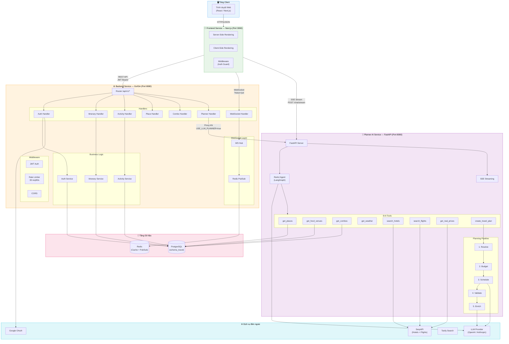
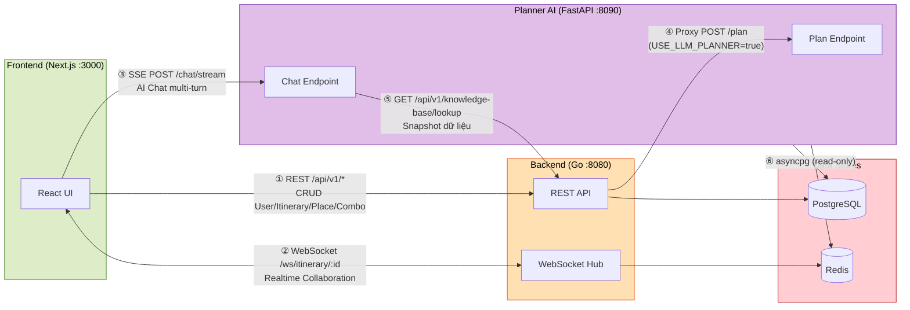

# 1. Sơ đồ Kiến trúc Hệ thống Tổng quan

## 1.1 Kiến trúc Microservices — 3 tầng

```mermaid
graph TB
    subgraph ClientLayer["🖥️ Tầng Client"]
        BROWSER["Trình duyệt Web<br/>(React / Next.js)"]
    end

    subgraph FrontendService["🎨 Frontend Service — Next.js (Port 3000)"]
        SSR["Server-Side Rendering"]
        CSR["Client-Side Rendering"]
        MW["Middleware<br/>(Auth Guard)"]
    end

    subgraph BackendService["⚙️ Backend Service — Go/Gin (Port 8080)"]
        direction TB
        ROUTER["Router /api/v1/*"]

        subgraph Handlers["Handlers"]
            AH["Auth Handler"]
            IH["Itinerary Handler"]
            ACH["Activity Handler"]
            PH["Place Handler"]
            CH["Combo Handler"]
            WSH["WebSocket Handler"]
            PLH["Planner Handler"]
        end

        subgraph Services["Business Logic"]
            AS["Auth Service"]
            IS["Itinerary Service"]
            ACS["Activity Service"]
        end

        subgraph Middleware["Middleware"]
            JWT_MW["JWT Auth"]
            RL["Rate Limiter<br/>30 req/60s"]
            CORS["CORS"]
        end

        subgraph WSLayer["WebSocket Layer"]
            HUB["WS Hub"]
            RPS["Redis PubSub"]
        end
    end

    subgraph AIService["🤖 Planner AI Service — FastAPI (Port 8090)"]
        direction TB
        FAPI["FastAPI Server"]
        AGENT["ReAct Agent<br/>(LangGraph)"]
        STREAM["SSE Streaming"]

        subgraph Tools["8 AI Tools"]
            T_PLACES["get_places"]
            T_FOOD["get_food_venues"]
            T_COMBOS["get_combos"]
            T_WEATHER["get_weather"]
            T_HOTELS["search_hotels"]
            T_FLIGHTS["search_flights"]
            T_PRICES["get_real_prices"]
            T_PLAN["create_travel_plan"]
        end

        subgraph Pipeline["Planning Pipeline"]
            N1["1. Resolve"]
            N2["2. Budget"]
            N3["3. Schedule"]
            N4["4. Validate"]
            N5["5. Enrich"]
        end
    end

    subgraph DataLayer["💾 Tầng Dữ liệu"]
        PG[("PostgreSQL<br/>(schema_travel)")]
        RD[("Redis<br/>(Cache + PubSub)")]
    end

    subgraph External["🌐 Dịch vụ Bên ngoài"]
        LLM["LLM Provider<br/>(OpenAI / Anthropic)"]
        SERP["SerpAPI<br/>(Hotels + Flights)"]
        TAVILY["Tavily Search"]
        GOOGLE_AUTH["Google OAuth"]
    end

    BROWSER -->|"HTTPS/JSON"| FrontendService
    FrontendService -->|"REST API<br/>JWT Bearer"| ROUTER
    FrontendService -->|"WebSocket<br/>?token=jwt"| WSH
    FrontendService -->|"SSE Stream<br/>POST /chat/stream"| FAPI

    ROUTER --> AH & IH & ACH & PH & CH & PLH
    AH --> AS
    IH --> IS
    ACH --> ACS
    PLH -->|"Proxy khi<br/>USE_LLM_PLANNER=true"| FAPI
    WSH --> HUB --> RPS

    AS & IS & ACS --> PG
    RPS --> RD

    FAPI --> AGENT
    FAPI --> STREAM
    AGENT --> Tools
    T_PLAN --> N1 --> N2 --> N3 --> N4 --> N5
    T_PLACES & T_FOOD & T_COMBOS --> PG
    T_HOTELS & T_FLIGHTS & T_PRICES --> SERP
    AGENT --> LLM
    N3 & N5 --> LLM
    AH --> GOOGLE_AUTH

    style ClientLayer fill:#e8f4fd,stroke:#2196F3,color:#000
    style FrontendService fill:#e8f5e9,stroke:#4CAF50,color:#000
    style BackendService fill:#fff3e0,stroke:#FF9800,color:#000
    style AIService fill:#f3e5f5,stroke:#9C27B0,color:#000
    style DataLayer fill:#fce4ec,stroke:#E91E63,color:#000
    style External fill:#e0f7fa,stroke:#00BCD4,color:#000
```

## 1.2 Sơ đồ Giao tiếp giữa các Service

```mermaid
flowchart LR
    subgraph FE["Frontend (Next.js :3000)"]
        UI["React UI"]
    end

    subgraph BE["Backend (Go :8080)"]
        REST["REST API"]
        WS["WebSocket Hub"]
    end

    subgraph AI["Planner AI (FastAPI :8090)"]
        CHAT["Chat Endpoint"]
        PLAN["Plan Endpoint"]
    end

    subgraph DB["Data Stores"]
        PG[("PostgreSQL")]
        RD[("Redis")]
    end

    UI -->|"① REST /api/v1/*<br/>CRUD User/Itinerary/Place/Combo"| REST
    UI <-->|"② WebSocket /ws/itinerary/:id<br/>Realtime Collaboration"| WS
    UI -->|"③ SSE POST /chat/stream<br/>AI Chat multi-turn"| CHAT
    REST -->|"④ Proxy POST /plan<br/>(USE_LLM_PLANNER=true)"| PLAN
    CHAT -->|"⑤ GET /api/v1/knowledge-base/lookup<br/>Snapshot dữ liệu"| REST
    AI -->|"⑥ asyncpg (read-only)"| PG

    REST --> PG
    WS --> RD
    AI --> RD

    style FE fill:#dcedc8,stroke:#558B2F,color:#000
    style BE fill:#ffe0b2,stroke:#E65100,color:#000
    style AI fill:#e1bee7,stroke:#6A1B9A,color:#000
    style DB fill:#ffcdd2,stroke:#B71C1C,color:#000
```
