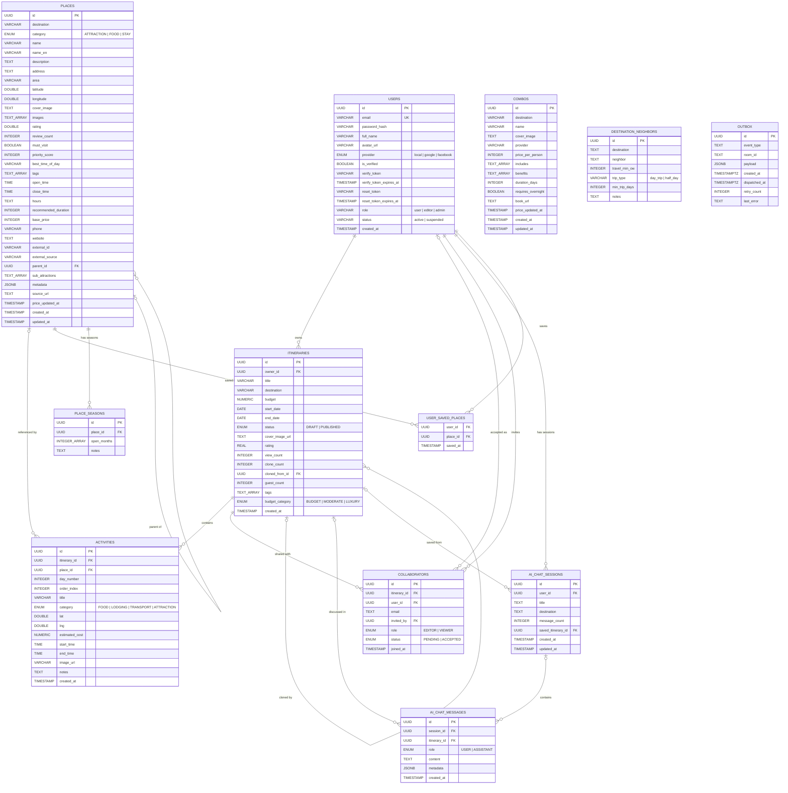
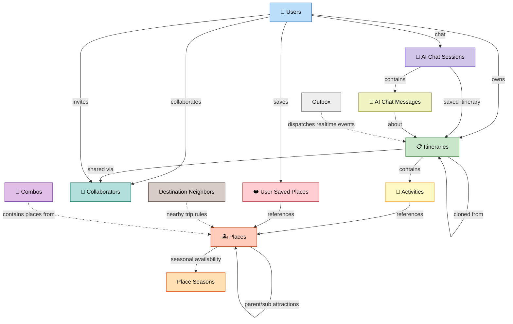

# 2. Sơ đồ ERD — Entity Relationship Diagram

## 2.1 Sơ đồ quan hệ thực thể (ERD)

Bản dễ xem hơn để trình bày là DBML cho dbdiagram.io:

- [`02-erd-logical.dbml`](./02-erd-logical.dbml): bản nên dùng cho slide, có node logic `destinations` để nối `places`, `itineraries`, `combos`, `destination_neighbors`; bỏ bảng kỹ thuật `outbox`.
- [`02-erd.dbml`](./02-erd.dbml): bản physical đúng theo database thật, nên một số bảng sẽ đứng lẻ nếu DB không có foreign key.

Cách dùng:

1. Mở dbdiagram.io.
2. Tạo diagram mới.
3. Copy nội dung `docs/diagrams/02-erd-logical.dbml` vào editor DBML nếu cần sơ đồ dễ nhìn, hoặc `02-erd.dbml` nếu cần đúng physical schema.
4. Dùng auto-layout/kéo thả để nhóm các cụm: users/auth, itinerary, places, AI chat, realtime outbox.

Mermaid dưới đây giữ lại làm bản tham chiếu trong Markdown.

## 2.2 Sơ đồ quan hệ đơn giản (rút gọn cho slide)

