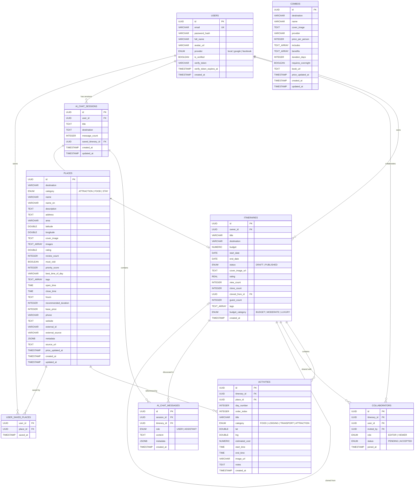
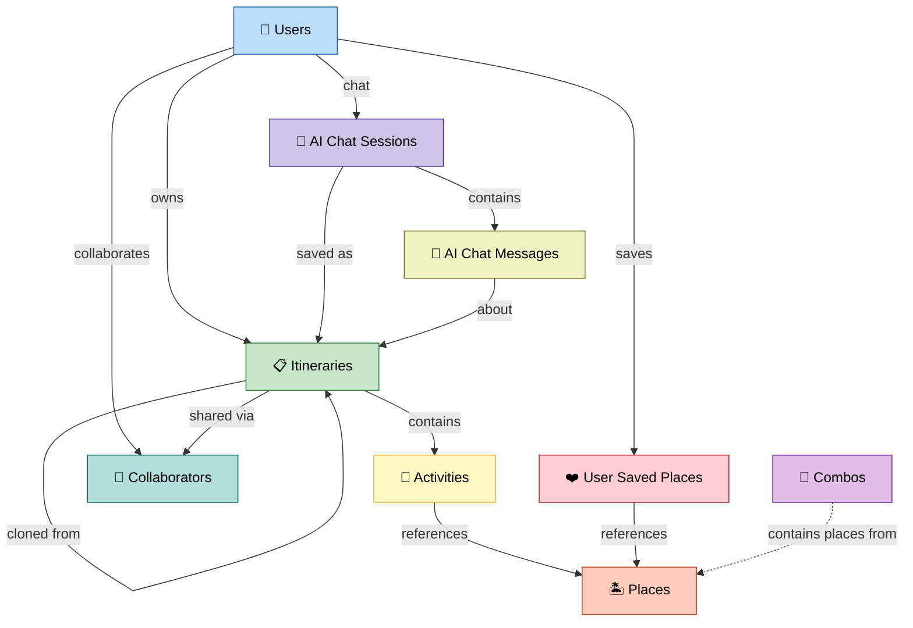

# 2. Sơ đồ ERD — Entity Relationship Diagram

## 2.1 Sơ đồ quan hệ thực thể (ERD)

```mermaid
erDiagram
    USERS {
        UUID id PK
        VARCHAR email UK
        VARCHAR password_hash
        VARCHAR full_name
        VARCHAR avatar_url
        ENUM provider "local | google | facebook"
        BOOLEAN is_verified
        VARCHAR verify_token
        TIMESTAMP verify_token_expires_at
        TIMESTAMP created_at
    }

    ITINERARIES {
        UUID id PK
        UUID owner_id FK
        VARCHAR title
        VARCHAR destination
        NUMERIC budget
        DATE start_date
        DATE end_date
        ENUM status "DRAFT | PUBLISHED"
        TEXT cover_image_url
        REAL rating
        INTEGER view_count
        INTEGER clone_count
        UUID cloned_from_id FK
        INTEGER guest_count
        TEXT_ARRAY tags
        ENUM budget_category "BUDGET | MODERATE | LUXURY"
        TIMESTAMP created_at
    }

    ACTIVITIES {
        UUID id PK
        UUID itinerary_id FK
        UUID place_id FK
        INTEGER day_number
        INTEGER order_index
        VARCHAR title
        ENUM category "FOOD | LODGING | TRANSPORT | ATTRACTION"
        DOUBLE lat
        DOUBLE lng
        NUMERIC estimated_cost
        TIME start_time
        TIME end_time
        VARCHAR image_url
        TEXT notes
        TIMESTAMP created_at
    }

    PLACES {
        UUID id PK
        VARCHAR destination
        ENUM category "ATTRACTION | FOOD | STAY"
        VARCHAR name
        VARCHAR name_en
        TEXT description
        TEXT address
        VARCHAR area
        DOUBLE latitude
        DOUBLE longitude
        TEXT cover_image
        TEXT_ARRAY images
        DOUBLE rating
        INTEGER review_count
        BOOLEAN must_visit
        INTEGER priority_score
        VARCHAR best_time_of_day
        TEXT_ARRAY tags
        TIME open_time
        TIME close_time
        TEXT hours
        INTEGER recommended_duration
        INTEGER base_price
        VARCHAR phone
        TEXT website
        VARCHAR external_id
        VARCHAR external_source
        JSONB metadata
        TEXT source_url
        TIMESTAMP price_updated_at
        TIMESTAMP created_at
        TIMESTAMP updated_at
    }

    COMBOS {
        UUID id PK
        VARCHAR destination
        VARCHAR name
        TEXT cover_image
        VARCHAR provider
        INTEGER price_per_person
        TEXT_ARRAY includes
        TEXT_ARRAY benefits
        INTEGER duration_days
        BOOLEAN requires_overnight
        TEXT book_url
        TIMESTAMP price_updated_at
        TIMESTAMP created_at
        TIMESTAMP updated_at
    }

    COLLABORATORS {
        UUID id PK
        UUID itinerary_id FK
        UUID user_id FK
        UUID invited_by FK
        ENUM role "EDITOR | VIEWER"
        ENUM status "PENDING | ACCEPTED"
        TIMESTAMP joined_at
    }

    AI_CHAT_SESSIONS {
        UUID id PK
        UUID user_id FK
        TEXT title
        TEXT destination
        INTEGER message_count
        UUID saved_itinerary_id FK
        TIMESTAMP created_at
        TIMESTAMP updated_at
    }

    AI_CHAT_MESSAGES {
        UUID id PK
        UUID session_id FK
        UUID itinerary_id FK
        ENUM role "USER | ASSISTANT"
        TEXT content
        JSONB metadata
        TIMESTAMP created_at
    }

    USER_SAVED_PLACES {
        UUID user_id FK
        UUID place_id FK
        TIMESTAMP saved_at
    }

    %% Relationships
    USERS ||--o{ ITINERARIES : "owns"
    USERS ||--o{ COLLABORATORS : "collaborates"
    USERS ||--o{ AI_CHAT_SESSIONS : "has sessions"
    USERS ||--o{ USER_SAVED_PLACES : "saves"

    ITINERARIES ||--o{ ACTIVITIES : "contains"
    ITINERARIES ||--o{ COLLABORATORS : "shared with"
    ITINERARIES ||--o| ITINERARIES : "cloned from"
    ITINERARIES ||--o{ AI_CHAT_MESSAGES : "discussed in"

    PLACES ||--o{ ACTIVITIES : "referenced by"
    PLACES ||--o{ USER_SAVED_PLACES : "saved by"

    AI_CHAT_SESSIONS ||--o{ AI_CHAT_MESSAGES : "contains"
    AI_CHAT_SESSIONS ||--o| ITINERARIES : "saved as"
```

## 2.2 Sơ đồ quan hệ đơn giản (rút gọn cho slide)

```mermaid
graph TB
    USER["👤 Users"] -->|"owns"| ITIN["📋 Itineraries"]
    USER -->|"saves"| USP["❤️ User Saved Places"]
    USER -->|"collaborates"| COLLAB["👥 Collaborators"]
    USER -->|"chat"| SESSION["💬 AI Chat Sessions"]

    ITIN -->|"contains"| ACT["📍 Activities"]
    ITIN -->|"shared via"| COLLAB
    ITIN -->|"cloned from"| ITIN

    ACT -->|"references"| PLACE["🏝️ Places"]
    USP -->|"references"| PLACE

    SESSION -->|"contains"| MSG["📝 AI Chat Messages"]
    SESSION -->|"saved as"| ITIN
    MSG -->|"about"| ITIN

    COMBO["🎁 Combos"] -.->|"contains places from"| PLACE

    style USER fill:#bbdefb,stroke:#1565C0,color:#000
    style ITIN fill:#c8e6c9,stroke:#2E7D32,color:#000
    style ACT fill:#fff9c4,stroke:#F9A825,color:#000
    style PLACE fill:#ffccbc,stroke:#BF360C,color:#000
    style COMBO fill:#e1bee7,stroke:#6A1B9A,color:#000
    style COLLAB fill:#b2dfdb,stroke:#00695C,color:#000
    style SESSION fill:#d1c4e9,stroke:#4527A0,color:#000
    style MSG fill:#f0f4c3,stroke:#827717,color:#000
    style USP fill:#ffcdd2,stroke:#B71C1C,color:#000
```
