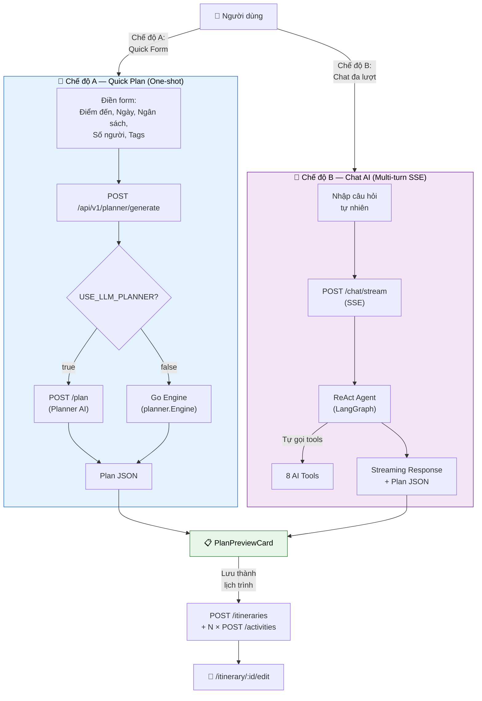
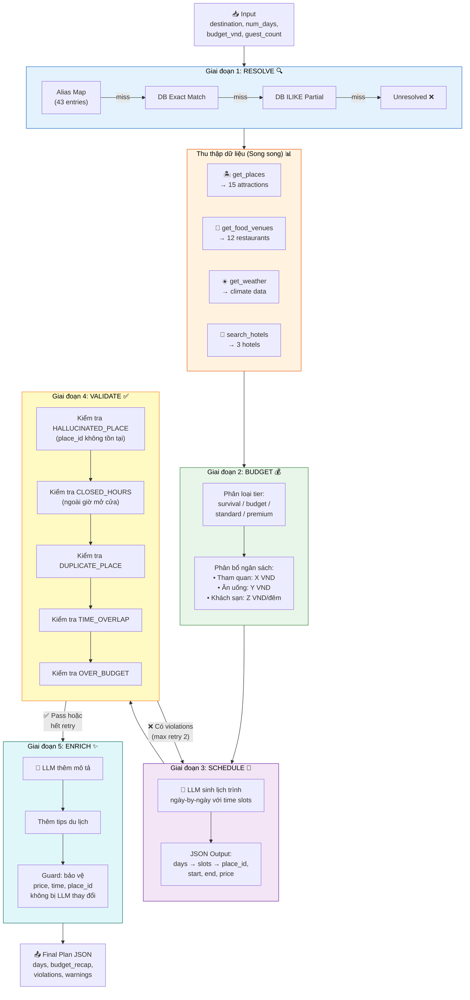
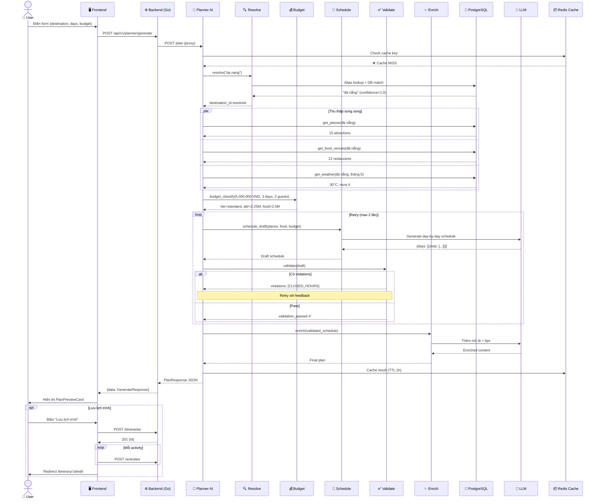
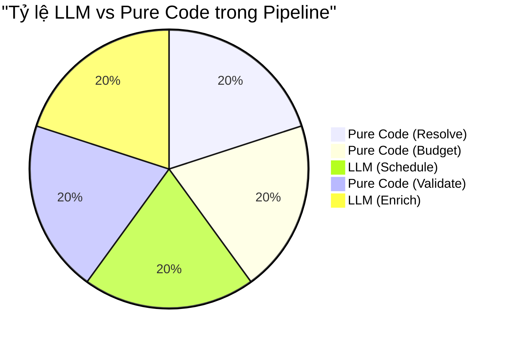

# 3. Sơ đồ Luồng AI Planner Pipeline

## 3.1 Tổng quan 2 chế độ hoạt động của AI Planner

## 3.2 Pipeline chi tiết — 5 Giai đoạn (create_travel_plan)

## 3.3 Sequence Diagram — Plan Mode (POST /plan)

## 3.4 Bảng LLM vs Pure Code trong Pipeline

| Giai đoạn | LLM? | Lý do |
|-----------|------|-------|
| 1. Resolve | ❌ Pure Code | Alias map + DB lookup — deterministic |
| 2. Budget | ❌ Pure Python | "LLM hallucinate numbers" — dùng math thuần |
| 3. Schedule | ✅ LLM | Cần creativity để sắp xếp lịch trình hợp lý |
| 4. Validate | ❌ Pure Rules | Bắt lỗi LLM bằng rule cứng, deterministic |
| 5. Enrich | ✅ LLM (guarded) | Thêm mô tả tự nhiên, nhưng guard bảo vệ data quan trọng |
