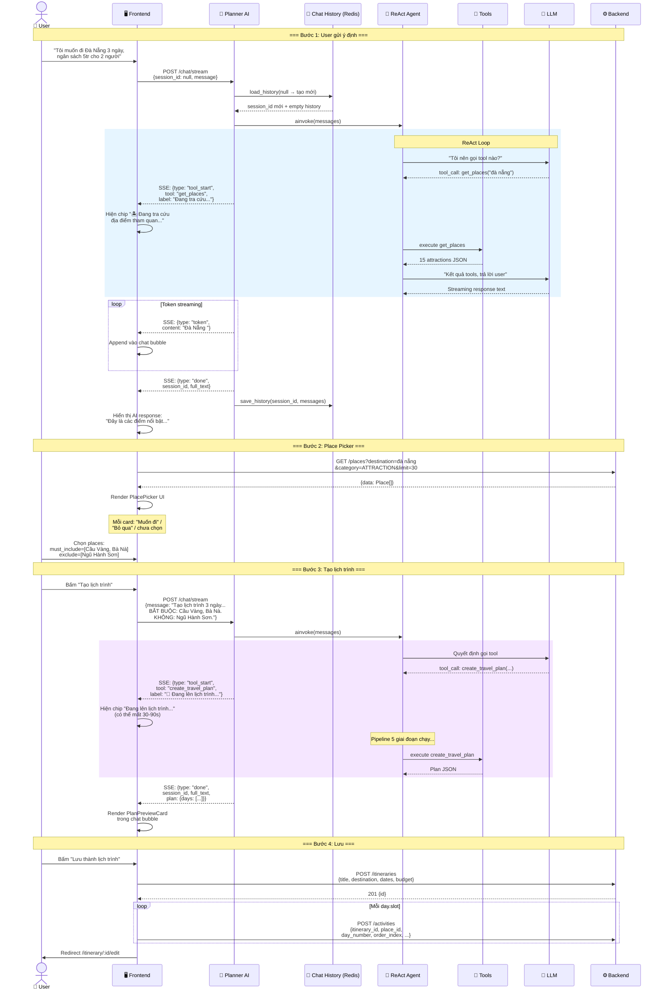
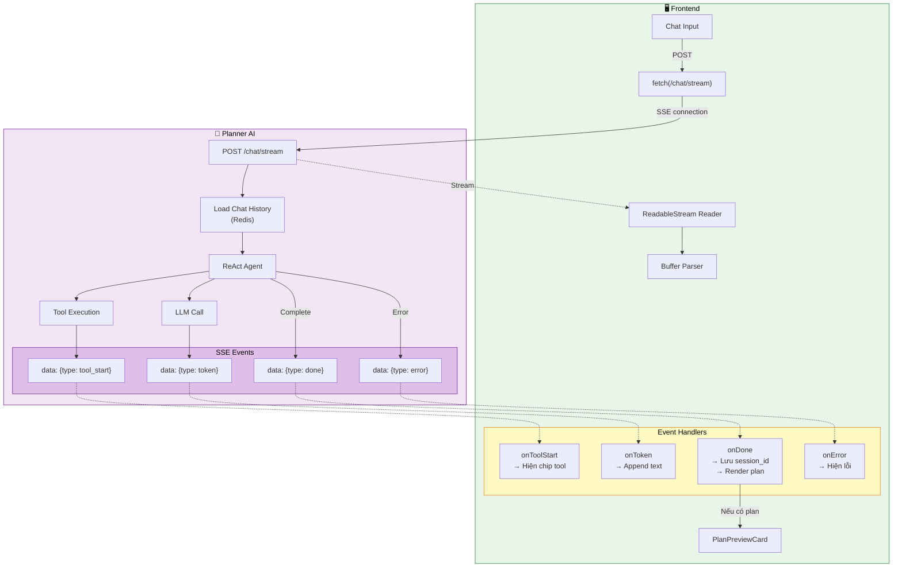
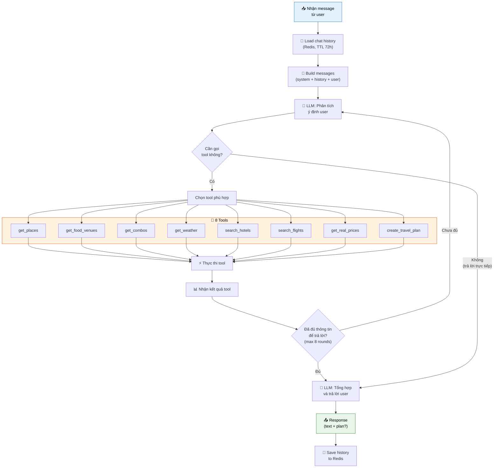

# 4. Sơ đồ Luồng Chat AI (SSE Streaming)

## 4.1 Sequence Diagram — Chat đa lượt với Place Picker

```mermaid
sequenceDiagram
    actor U as 👤 User
    participant FE as 🖥️ Frontend
    participant AI as 🤖 Planner AI
    participant HIST as 📜 Chat History (Redis)
    participant AGENT as 🧠 ReAct Agent
    participant TOOLS as 🔧 Tools
    participant LLM as 🧠 LLM
    participant BE as ⚙️ Backend

    Note over U,BE: === Bước 1: User gửi ý định ===

    U->>FE: "Tôi muốn đi Đà Nẵng 3 ngày,<br/>ngân sách 5tr cho 2 người"
    FE->>AI: POST /chat/stream<br/>{session_id: null, message}

    AI->>HIST: load_history(null → tạo mới)
    HIST-->>AI: session_id mới + empty history

    AI->>AGENT: ainvoke(messages)

    rect rgb(230, 245, 255)
        Note over AGENT,LLM: ReAct Loop
        AGENT->>LLM: "Tôi nên gọi tool nào?"
        LLM-->>AGENT: tool_call: get_places("đà nẵng")

        AI-->>FE: SSE: {type: "tool_start",<br/>tool: "get_places",<br/>label: "Đang tra cứu..."}
        FE->>FE: Hiện chip "🏝️ Đang tra cứu<br/>địa điểm tham quan..."

        AGENT->>TOOLS: execute get_places
        TOOLS-->>AGENT: 15 attractions JSON

        AGENT->>LLM: "Kết quả tools, trả lời user"
        LLM-->>AGENT: Streaming response text
    end

    loop Token streaming
        AI-->>FE: SSE: {type: "token",<br/>content: "Đà Nẵng "}
        FE->>FE: Append vào chat bubble
    end

    AI-->>FE: SSE: {type: "done",<br/>session_id, full_text}
    AI->>HIST: save_history(session_id, messages)

    FE->>FE: Hiển thị AI response:<br/>"Đây là các điểm nổi bật..."

    Note over U,BE: === Bước 2: Place Picker ===

    FE->>BE: GET /places?destination=đà nẵng<br/>&category=ATTRACTION&limit=30
    BE-->>FE: {data: Place[]}

    FE->>FE: Render PlacePicker UI
    Note over FE: Mỗi card: "Muốn đi" /<br/>"Bỏ qua" / chưa chọn

    U->>FE: Chọn places:<br/>must_include=[Cầu Vàng, Bà Nà]<br/>exclude=[Ngũ Hành Sơn]

    Note over U,BE: === Bước 3: Tạo lịch trình ===

    U->>FE: Bấm "Tạo lịch trình"
    FE->>AI: POST /chat/stream<br/>{message: "Tạo lịch trình 3 ngày...<br/>BẮT BUỘC: Cầu Vàng, Bà Nà.<br/>KHÔNG: Ngũ Hành Sơn."}

    AI->>AGENT: ainvoke(messages)

    rect rgb(245, 230, 255)
        AGENT->>LLM: Quyết định gọi tool
        LLM-->>AGENT: tool_call: create_travel_plan(...)

        AI-->>FE: SSE: {type: "tool_start",<br/>tool: "create_travel_plan",<br/>label: "📅 Đang lên lịch trình..."}
        FE->>FE: Hiện chip "Đang lên lịch trình..."<br/>(có thể mất 30-90s)

        Note over AGENT: Pipeline 5 giai đoạn chạy...
        AGENT->>TOOLS: execute create_travel_plan
        TOOLS-->>AGENT: Plan JSON
    end

    AI-->>FE: SSE: {type: "done",<br/>session_id, full_text,<br/>plan: {days: [...]}}

    FE->>FE: Render PlanPreviewCard<br/>trong chat bubble

    Note over U,BE: === Bước 4: Lưu ===

    U->>FE: Bấm "Lưu thành lịch trình"
    FE->>BE: POST /itineraries<br/>{title, destination, dates, budget}
    BE-->>FE: 201 {id}

    loop Mỗi day.slot
        FE->>BE: POST /activities<br/>{itinerary_id, place_id,<br/>day_number, order_index, ...}
    end

    FE->>U: Redirect /itinerary/:id/edit
```

## 4.2 SSE Event Flow Diagram

```mermaid
flowchart TB
    subgraph Client["🖥️ Frontend"]
        direction TB
        INPUT["Chat Input"]
        FETCH["fetch(/chat/stream)"]
        READER["ReadableStream Reader"]
        BUFFER["Buffer Parser"]

        subgraph EventHandlers["Event Handlers"]
            H_TOOL["onToolStart<br/>→ Hiện chip tool"]
            H_TOKEN["onToken<br/>→ Append text"]
            H_DONE["onDone<br/>→ Lưu session_id<br/>→ Render plan"]
            H_ERROR["onError<br/>→ Hiện lỗi"]
        end

        PLAN_CARD["PlanPreviewCard"]
    end

    subgraph Server["🤖 Planner AI"]
        direction TB
        ROUTE["POST /chat/stream"]
        HISTORY["Load Chat History<br/>(Redis)"]
        AGENT["ReAct Agent"]
        TOOL_EXEC["Tool Execution"]
        LLM_CALL["LLM Call"]

        subgraph SSE_Events["SSE Events"]
            E1["data: {type: tool_start}"]
            E2["data: {type: token}"]
            E3["data: {type: done}"]
            E4["data: {type: error}"]
        end
    end

    INPUT -->|"POST"| FETCH
    FETCH -->|"SSE connection"| ROUTE
    ROUTE --> HISTORY --> AGENT

    AGENT --> TOOL_EXEC --> E1
    AGENT --> LLM_CALL --> E2
    AGENT -->|"Complete"| E3
    AGENT -->|"Error"| E4

    ROUTE -.->|"Stream"| READER
    READER --> BUFFER

    E1 -.-> H_TOOL
    E2 -.-> H_TOKEN
    E3 -.-> H_DONE
    E4 -.-> H_ERROR

    H_DONE -->|"Nếu có plan"| PLAN_CARD

    style Client fill:#e8f5e9,stroke:#2E7D32,color:#000
    style Server fill:#f3e5f5,stroke:#6A1B9A,color:#000
    style EventHandlers fill:#fff9c4,stroke:#F57F17,color:#000
    style SSE_Events fill:#e1bee7,stroke:#6A1B9A,color:#000
```

## 4.3 ReAct Agent Decision Loop

```mermaid
flowchart TB
    START["📥 Nhận message<br/>từ user"]
    LOAD["📜 Load chat history<br/>(Redis, TTL 72h)"]
    BUILD["🔨 Build messages<br/>(system + history + user)"]
    LLM_THINK["🧠 LLM: Phân tích<br/>ý định user"]

    DECIDE{"Cần gọi<br/>tool không?"}

    TOOL_SELECT["Chọn tool phù hợp"]

    subgraph ToolBox["🧰 8 Tools"]
        T1["get_places"]
        T2["get_food_venues"]
        T3["get_combos"]
        T4["get_weather"]
        T5["search_hotels"]
        T6["search_flights"]
        T7["get_real_prices"]
        T8["create_travel_plan"]
    end

    EXEC["⚡ Thực thi tool"]
    RESULT["📊 Nhận kết quả tool"]

    RESPOND["💬 LLM: Tổng hợp<br/>và trả lời user"]

    CHECK{"Đã đủ thông tin<br/>để trả lời?<br/>(max 8 rounds)"}

    OUTPUT["📤 Response<br/>(text + plan?)"]
    SAVE["💾 Save history<br/>to Redis"]

    START --> LOAD --> BUILD --> LLM_THINK --> DECIDE

    DECIDE -->|"Có"| TOOL_SELECT
    TOOL_SELECT --> T1 & T2 & T3 & T4 & T5 & T6 & T7 & T8
    T1 & T2 & T3 & T4 & T5 & T6 & T7 & T8 --> EXEC
    EXEC --> RESULT --> CHECK

    CHECK -->|"Chưa đủ"| LLM_THINK
    CHECK -->|"Đủ"| RESPOND

    DECIDE -->|"Không<br/>(trả lời trực tiếp)"| RESPOND

    RESPOND --> OUTPUT --> SAVE

    style START fill:#e3f2fd,stroke:#1565C0,color:#000
    style ToolBox fill:#fff3e0,stroke:#E65100,color:#000
    style OUTPUT fill:#e8f5e9,stroke:#2E7D32,color:#000
```
