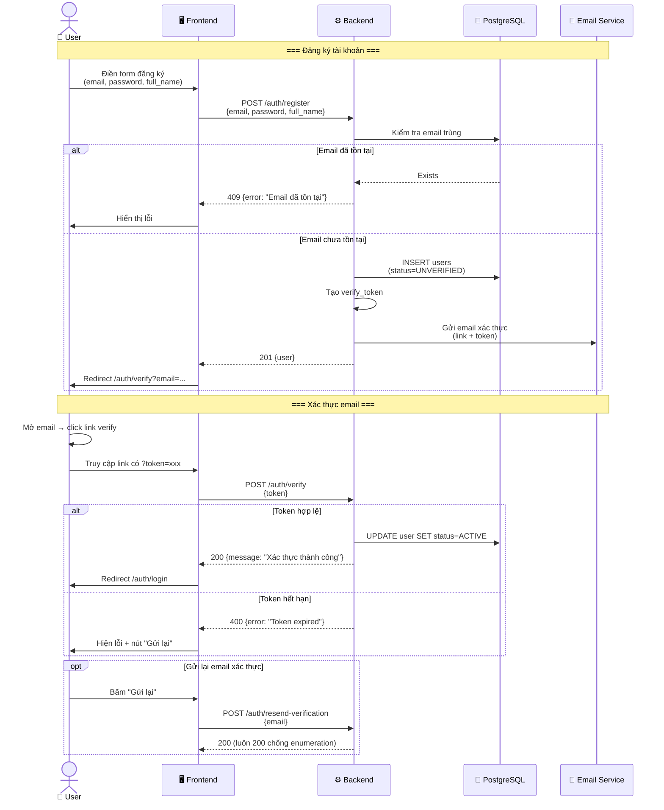
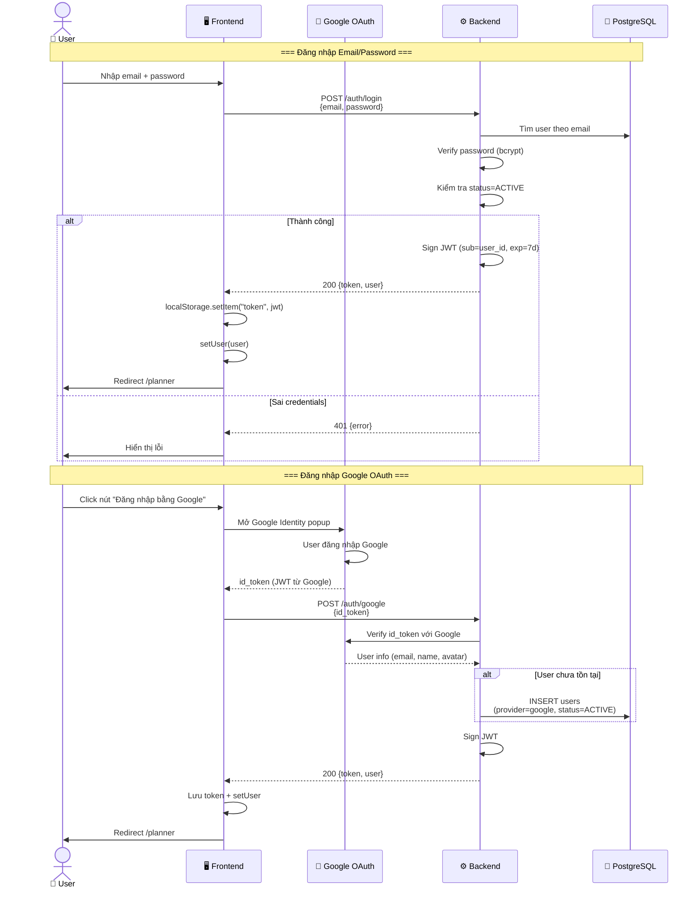
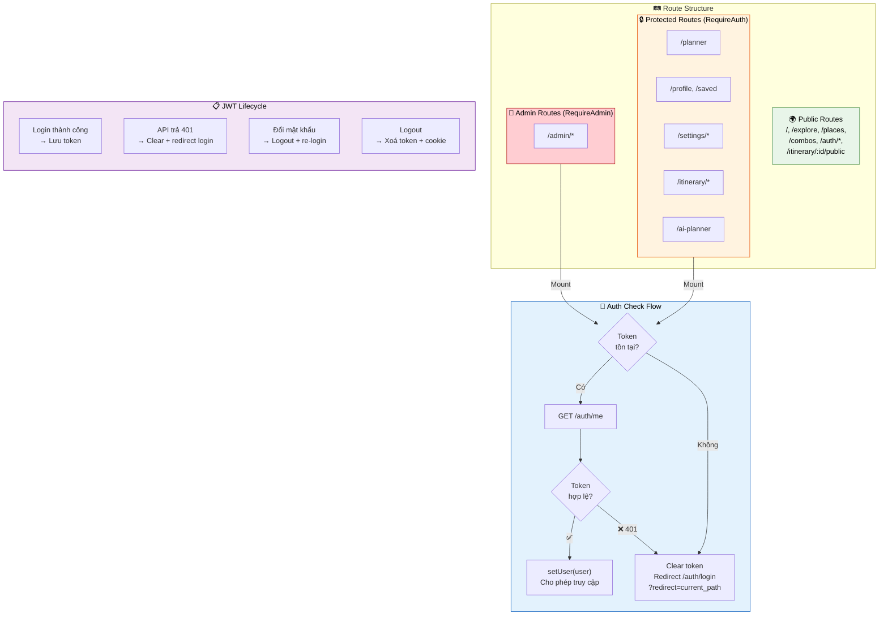

# 5. Sơ đồ Luồng Xác thực (Authentication Flow)

## 5.1 Luồng Đăng ký + Xác thực Email

```mermaid
sequenceDiagram
    actor U as 👤 User
    participant FE as 🖥️ Frontend
    participant BE as ⚙️ Backend
    participant DB as 💾 PostgreSQL
    participant EMAIL as 📧 Email Service

    Note over U,EMAIL: === Đăng ký tài khoản ===

    U->>FE: Điền form đăng ký<br/>(email, password, full_name)
    FE->>BE: POST /auth/register<br/>{email, password, full_name}

    BE->>DB: Kiểm tra email trùng
    alt Email đã tồn tại
        DB-->>BE: Exists
        BE-->>FE: 409 {error: "Email đã tồn tại"}
        FE->>U: Hiển thị lỗi
    else Email chưa tồn tại
        BE->>DB: INSERT users<br/>(status=UNVERIFIED)
        BE->>BE: Tạo verify_token
        BE->>EMAIL: Gửi email xác thực<br/>(link + token)
        BE-->>FE: 201 {user}
        FE->>U: Redirect /auth/verify?email=...
    end

    Note over U,EMAIL: === Xác thực email ===

    U->>U: Mở email → click link verify
    U->>FE: Truy cập link có ?token=xxx
    FE->>BE: POST /auth/verify<br/>{token}

    alt Token hợp lệ
        BE->>DB: UPDATE user SET status=ACTIVE
        BE-->>FE: 200 {message: "Xác thực thành công"}
        FE->>U: Redirect /auth/login
    else Token hết hạn
        BE-->>FE: 400 {error: "Token expired"}
        FE->>U: Hiện lỗi + nút "Gửi lại"
    end

    opt Gửi lại email xác thực
        U->>FE: Bấm "Gửi lại"
        FE->>BE: POST /auth/resend-verification<br/>{email}
        BE-->>FE: 200 (luôn 200 chống enumeration)
    end
```

## 5.2 Luồng Đăng nhập (Email/Password + OAuth)

```mermaid
sequenceDiagram
    actor U as 👤 User
    participant FE as 🖥️ Frontend
    participant GOOGLE as 🔐 Google OAuth
    participant BE as ⚙️ Backend
    participant DB as 💾 PostgreSQL

    Note over U,DB: === Đăng nhập Email/Password ===

    U->>FE: Nhập email + password
    FE->>BE: POST /auth/login<br/>{email, password}

    BE->>DB: Tìm user theo email
    BE->>BE: Verify password (bcrypt)
    BE->>BE: Kiểm tra status=ACTIVE

    alt Thành công
        BE->>BE: Sign JWT (sub=user_id, exp=7d)
        BE-->>FE: 200 {token, user}
        FE->>FE: localStorage.setItem("token", jwt)
        FE->>FE: setUser(user)
        FE->>U: Redirect /planner
    else Sai credentials
        BE-->>FE: 401 {error}
        FE->>U: Hiển thị lỗi
    end

    Note over U,DB: === Đăng nhập Google OAuth ===

    U->>FE: Click nút "Đăng nhập bằng Google"
    FE->>GOOGLE: Mở Google Identity popup
    GOOGLE->>GOOGLE: User đăng nhập Google
    GOOGLE-->>FE: id_token (JWT từ Google)

    FE->>BE: POST /auth/google<br/>{id_token}
    BE->>GOOGLE: Verify id_token với Google
    GOOGLE-->>BE: User info (email, name, avatar)

    alt User chưa tồn tại
        BE->>DB: INSERT users<br/>(provider=google, status=ACTIVE)
    end

    BE->>BE: Sign JWT
    BE-->>FE: 200 {token, user}
    FE->>FE: Lưu token + setUser
    FE->>U: Redirect /planner
```

## 5.3 Sơ đồ Bảo vệ Route + JWT Lifecycle

```mermaid
flowchart TB
    subgraph Routes["🛤️ Route Structure"]
        direction TB
        PUBLIC["🌍 Public Routes<br/>/, /explore, /places,<br/>/combos, /auth/*,<br/>/itinerary/:id/public"]

        subgraph Protected["🔒 Protected Routes (RequireAuth)"]
            PLANNER["/planner"]
            PROFILE["/profile, /saved"]
            SETTINGS["/settings/*"]
            ITINERARY["/itinerary/*"]
            AI_PLANNER["/ai-planner"]
        end

        subgraph Admin["🔑 Admin Routes (RequireAdmin)"]
            ADMIN["/admin/*"]
        end
    end

    subgraph AuthFlow["🔐 Auth Check Flow"]
        direction TB
        CHECK_TOKEN{"Token<br/>tồn tại?"}
        VERIFY_TOKEN["GET /auth/me"]
        TOKEN_VALID{"Token<br/>hợp lệ?"}
        SET_USER["setUser(user)<br/>Cho phép truy cập"]
        CLEAR["Clear token<br/>Redirect /auth/login<br/>?redirect=current_path"]
    end

    subgraph JWTLifecycle["📋 JWT Lifecycle"]
        direction TB
        LOGIN_OK["Login thành công<br/>→ Lưu token"]
        API_401["API trả 401<br/>→ Clear + redirect login"]
        CHANGE_PASS["Đổi mật khẩu<br/>→ Logout + re-login"]
        LOGOUT["Logout<br/>→ Xoá token + cookie"]
    end

    Protected -->|"Mount"| CHECK_TOKEN
    Admin -->|"Mount"| CHECK_TOKEN

    CHECK_TOKEN -->|"Không"| CLEAR
    CHECK_TOKEN -->|"Có"| VERIFY_TOKEN
    VERIFY_TOKEN --> TOKEN_VALID
    TOKEN_VALID -->|"✅"| SET_USER
    TOKEN_VALID -->|"❌ 401"| CLEAR

    style PUBLIC fill:#e8f5e9,stroke:#2E7D32,color:#000
    style Protected fill:#fff3e0,stroke:#E65100,color:#000
    style Admin fill:#ffcdd2,stroke:#B71C1C,color:#000
    style AuthFlow fill:#e3f2fd,stroke:#1565C0,color:#000
    style JWTLifecycle fill:#f3e5f5,stroke:#6A1B9A,color:#000
```
