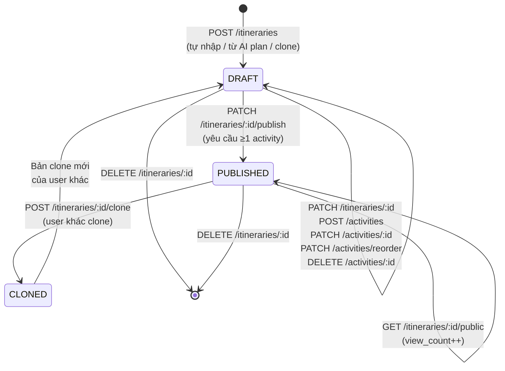
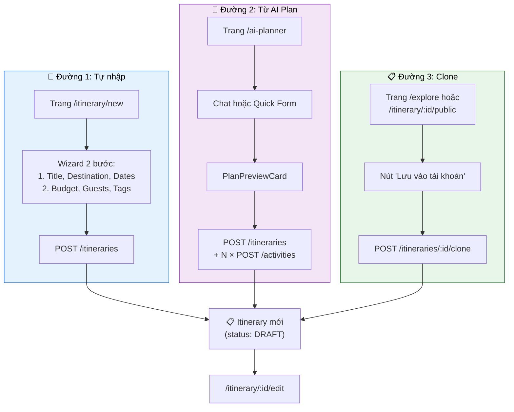
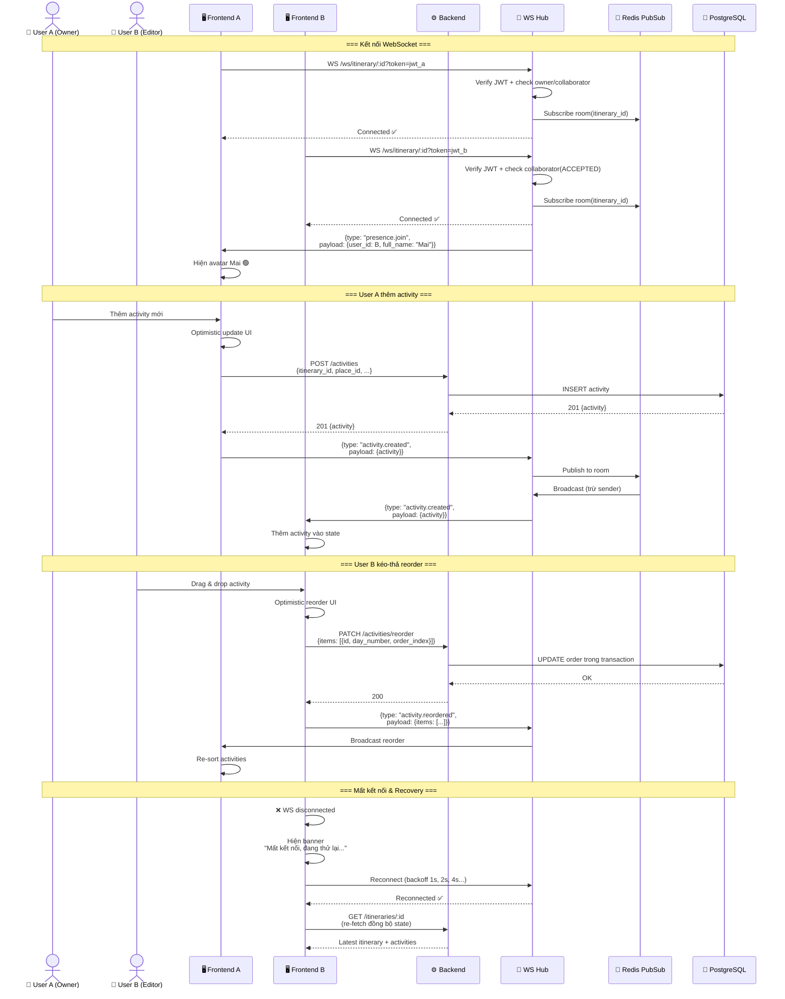
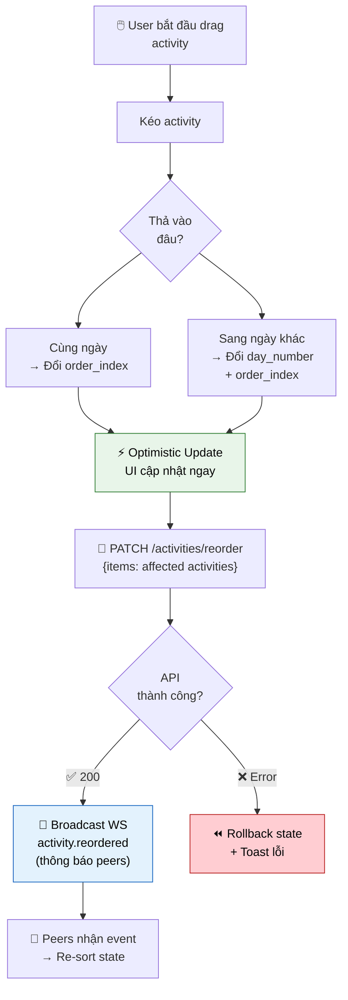
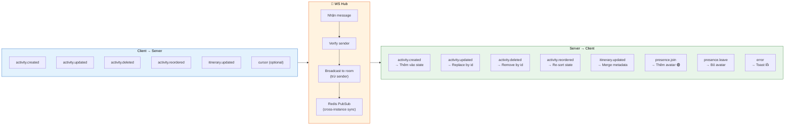

# 6. Sơ đồ Luồng CRUD & Realtime Itinerary

## 6.1 Vòng đời Itinerary — State Diagram

## 6.2 Ba đường vào tạo Itinerary

## 6.3 Sequence Diagram — WebSocket Realtime Collaboration

## 6.4 Activity Drag & Drop Flow

## 6.5 WebSocket Protocol — Message Types

