# 7. Sơ đồ Use-Case Tổng quan

## 7.1 Use-Case Diagram

```mermaid
flowchart TB
    subgraph Actors["Tác nhân"]
        GUEST["👤 Khách<br/>(Guest)"]
        USER["👤 Người dùng<br/>(Authenticated User)"]
        ADMIN["🔑 Quản trị viên<br/>(Admin)"]
        AI["🤖 AI Planner<br/>(System)"]
    end

    subgraph UC_Auth["🔐 Xác thực"]
        UC1["Đăng ký tài khoản"]
        UC2["Đăng nhập<br/>(Email/Password)"]
        UC3["Đăng nhập<br/>(Google OAuth)"]
        UC4["Xác thực email"]
        UC5["Đổi mật khẩu"]
    end

    subgraph UC_Explore["🌍 Khám phá"]
        UC6["Xem danh sách<br/>địa điểm"]
        UC7["Xem chi tiết<br/>địa điểm"]
        UC8["Xem combo tour"]
        UC9["Xem lịch trình<br/>cộng đồng"]
        UC10["Tìm kiếm & lọc<br/>địa điểm"]
    end

    subgraph UC_Plan["📅 Lập lịch trình"]
        UC11["Tạo lịch trình<br/>thủ công"]
        UC12["Tạo lịch trình<br/>bằng AI (Quick)"]
        UC13["Chat AI đa lượt"]
        UC14["Chọn địa điểm<br/>(Place Picker)"]
        UC15["Lưu plan AI<br/>thành itinerary"]
        UC16["Clone lịch trình"]
    end

    subgraph UC_Edit["📝 Chỉnh sửa lịch trình"]
        UC17["Thêm/Sửa/Xóa<br/>activity"]
        UC18["Kéo-thả sắp xếp<br/>activity"]
        UC19["Cộng tác realtime<br/>(WebSocket)"]
        UC20["Xuất bản lịch trình"]
        UC21["Chia sẻ lịch trình"]
    end

    subgraph UC_Personal["❤️ Cá nhân"]
        UC22["Lưu địa điểm<br/>yêu thích"]
        UC23["Quản lý hồ sơ"]
        UC24["Xem lịch trình<br/>đã tạo"]
    end

    subgraph UC_Admin["🔧 Quản trị"]
        UC25["Quản lý places"]
        UC26["Quản lý combos"]
        UC27["Flush AI cache"]
        UC28["Import dữ liệu<br/>(Knowledge Base)"]
    end

    %% Guest use cases
    GUEST --> UC1 & UC2 & UC3
    GUEST --> UC6 & UC7 & UC8 & UC9 & UC10

    %% User use cases (includes guest)
    USER --> UC4 & UC5
    USER --> UC11 & UC12 & UC13 & UC14 & UC15 & UC16
    USER --> UC17 & UC18 & UC19 & UC20 & UC21
    USER --> UC22 & UC23 & UC24

    %% Admin use cases
    ADMIN --> UC25 & UC26 & UC27 & UC28

    %% AI involvement
    AI -.->|"supports"| UC12
    AI -.->|"supports"| UC13
    AI -.->|"supports"| UC14

    style UC_Auth fill:#e3f2fd,stroke:#1565C0,color:#000
    style UC_Explore fill:#e8f5e9,stroke:#2E7D32,color:#000
    style UC_Plan fill:#f3e5f5,stroke:#6A1B9A,color:#000
    style UC_Edit fill:#fff3e0,stroke:#E65100,color:#000
    style UC_Personal fill:#fce4ec,stroke:#C62828,color:#000
    style UC_Admin fill:#fff9c4,stroke:#F57F17,color:#000
```

## 7.2 Activity Diagram — Luồng chính: Lập kế hoạch du lịch bằng AI

```mermaid
flowchart TB
    START(("🟢 Bắt đầu"))

    LOGIN{"Đã đăng nhập?"}
    DO_LOGIN["Đăng nhập<br/>(Email / Google)"]

    CHOOSE{"Chọn chế độ<br/>lập kế hoạch"}

    subgraph QuickMode["⚡ Quick Plan"]
        QM1["Điền form:<br/>Điểm đến, Ngày,<br/>Ngân sách, Số người"]
        QM2["Gửi request"]
        QM3["Chờ AI xử lý<br/>(5-90 giây)"]
    end

    subgraph ChatMode["💬 Chat AI"]
        CM1["Nhập câu hỏi<br/>tự nhiên"]
        CM2["AI trả lời<br/>+ gợi ý"]
        CM3{"Muốn chọn<br/>địa điểm?"}
        CM4["Place Picker:<br/>Muốn đi / Bỏ qua"]
        CM5["Yêu cầu AI<br/>tạo lịch trình"]
        CM6["AI tạo plan<br/>(Pipeline 5 bước)"]

        CM1 --> CM2 --> CM3
        CM3 -->|"Có"| CM4 --> CM5 --> CM6
        CM3 -->|"Không,<br/>hỏi thêm"| CM1
    end

    PREVIEW["📋 Xem PlanPreviewCard"]

    SATISFY{"Hài lòng<br/>với plan?"}

    MODIFY["Yêu cầu AI<br/>chỉnh sửa"]

    SAVE["💾 Lưu thành<br/>lịch trình"]
    CREATE_ITIN["POST /itineraries"]
    CREATE_ACTS["POST /activities × N"]

    EDIT["📝 Chỉnh sửa<br/>lịch trình"]

    COLLAB{"Mời<br/>cộng tác?"}
    INVITE["Mời collaborator"]
    REALTIME["Cộng tác<br/>realtime (WS)"]

    PUBLISH{"Xuất bản?"}
    DO_PUBLISH["Xuất bản<br/>lên cộng đồng"]

    FINISH(("🔴 Kết thúc"))

    START --> LOGIN
    LOGIN -->|"Chưa"| DO_LOGIN --> CHOOSE
    LOGIN -->|"Rồi"| CHOOSE

    CHOOSE -->|"Quick"| QuickMode
    CHOOSE -->|"Chat"| ChatMode

    QM1 --> QM2 --> QM3 --> PREVIEW
    CM6 --> PREVIEW

    PREVIEW --> SATISFY
    SATISFY -->|"❌"| MODIFY --> PREVIEW
    SATISFY -->|"✅"| SAVE

    SAVE --> CREATE_ITIN --> CREATE_ACTS --> EDIT

    EDIT --> COLLAB
    COLLAB -->|"Có"| INVITE --> REALTIME --> PUBLISH
    COLLAB -->|"Không"| PUBLISH

    PUBLISH -->|"Có"| DO_PUBLISH --> FINISH
    PUBLISH -->|"Không"| FINISH

    style QuickMode fill:#e3f2fd,stroke:#1565C0,color:#000
    style ChatMode fill:#f3e5f5,stroke:#6A1B9A,color:#000
    style PREVIEW fill:#e8f5e9,stroke:#2E7D32,color:#000
```

## 7.3 Bảng chức năng theo vai trò

| Chức năng | Guest | User | Admin |
|-----------|:-----:|:----:|:-----:|
| Xem danh sách địa điểm | ✅ | ✅ | ✅ |
| Xem chi tiết địa điểm | ✅ | ✅ | ✅ |
| Xem combo tour | ✅ | ✅ | ✅ |
| Xem lịch trình cộng đồng | ✅ | ✅ | ✅ |
| Đăng ký / Đăng nhập | ✅ | — | — |
| Lưu địa điểm yêu thích | ❌ | ✅ | ✅ |
| Tạo lịch trình (thủ công) | ❌ | ✅ | ✅ |
| Tạo lịch trình bằng AI | ❌ | ✅ | ✅ |
| Chat AI đa lượt | ❌ | ✅ | ✅ |
| Chỉnh sửa lịch trình | ❌ | ✅ (owner/editor) | ✅ |
| Cộng tác realtime | ❌ | ✅ | ✅ |
| Clone lịch trình | ❌ | ✅ | ✅ |
| Xuất bản / Chia sẻ | ❌ | ✅ (owner) | ✅ |
| Quản lý Places/Combos | ❌ | ❌ | ✅ |
| Flush AI Cache | ❌ | ❌ | ✅ |
| Import Knowledge Base | ❌ | ❌ | ✅ |
