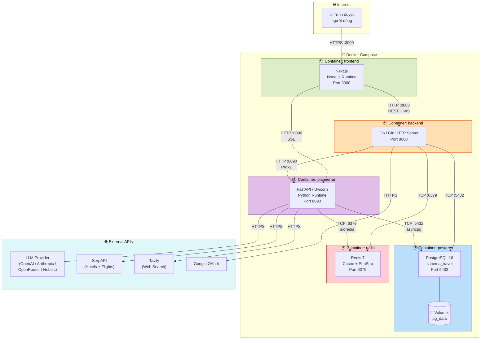
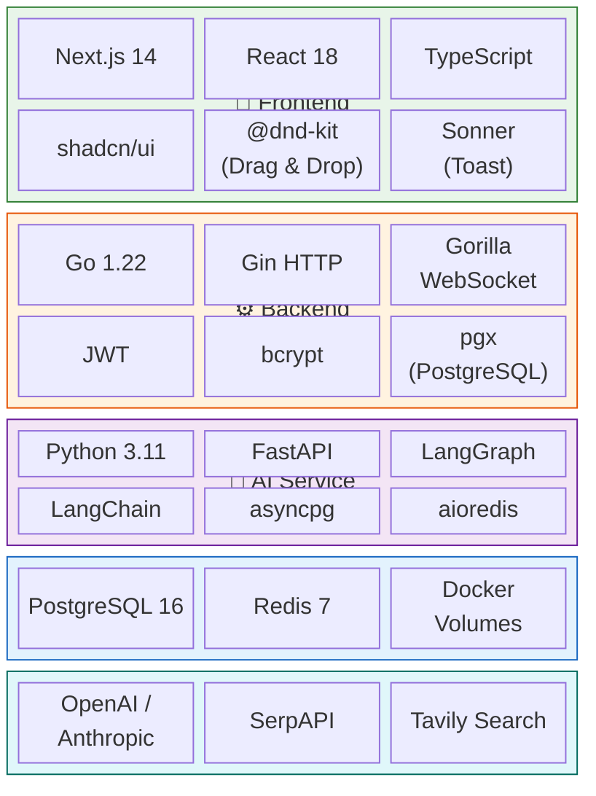
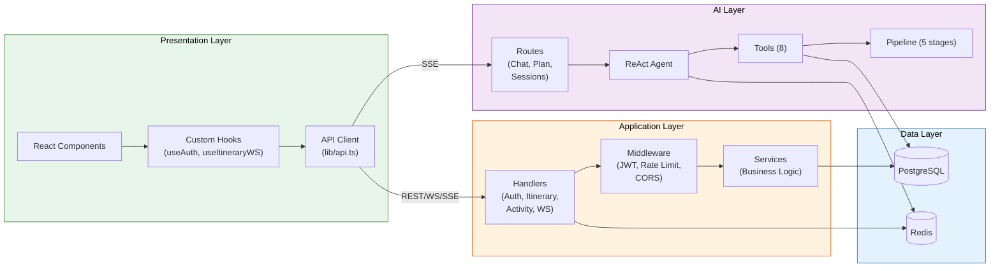

# 8. Sơ đồ Deployment & Technology Stack

## 8.1 Sơ đồ Deployment (Docker Compose)

## 8.2 Technology Stack

## 8.3 Bảng Technology Stack chi tiết

| Tầng | Công nghệ | Phiên bản | Mục đích |
|------|-----------|-----------|----------|
| **Frontend** | Next.js | 14 | Framework React SSR/CSR |
| | React | 18 | UI Library |
| | TypeScript | 5.x | Type-safe JavaScript |
| | shadcn/ui | Latest | UI Component Library |
| | @dnd-kit | Latest | Drag & Drop |
| | Sonner | Latest | Toast notifications |
| **Backend** | Go | 1.22 | Ngôn ngữ chính |
| | Gin | Latest | HTTP Framework |
| | Gorilla WebSocket | Latest | WebSocket support |
| | JWT-Go | Latest | JWT authentication |
| | pgx | v5 | PostgreSQL driver |
| **AI Service** | Python | 3.11 | Ngôn ngữ chính |
| | FastAPI | Latest | HTTP Framework |
| | LangGraph | Latest | Agent orchestration |
| | LangChain | Latest | LLM toolchain |
| | asyncpg | Latest | Async PostgreSQL |
| | aioredis | Latest | Async Redis |
| **Database** | PostgreSQL | 16 | Relational database |
| | Redis | 7 | Cache + PubSub |
| **DevOps** | Docker | Latest | Containerization |
| | Docker Compose | Latest | Orchestration |
| **External** | OpenAI / Anthropic | — | LLM Provider |
| | SerpAPI | — | Hotel + Flight search |
| | Tavily | — | Web search |
| | Google OAuth | v2 | Authentication |

## 8.4 Sơ đồ luồng dữ liệu giữa các lớp

